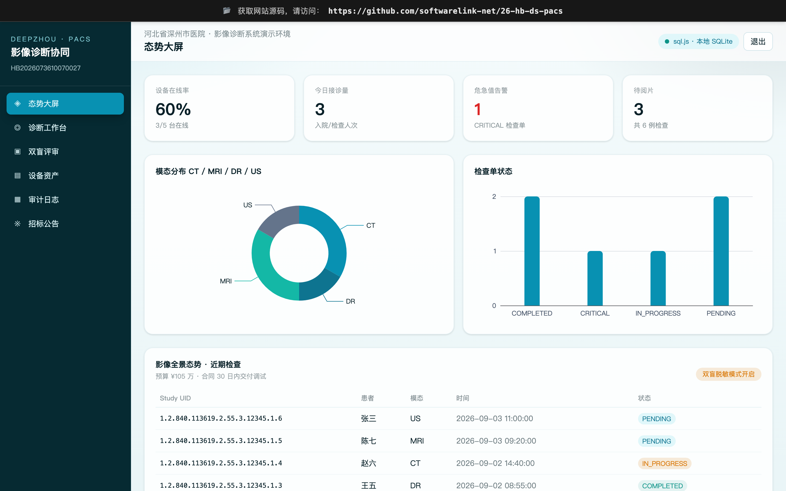

# 河北省深州市医院影像诊断系统采购项目 

🌐 **上线主域名**: https://26-hb-ds-pacs.softwarelink.net/

💻 **项目仓库**: https://github.com/softwarelink-net/26-hb-ds-pacs



## 🚀 项目简介
本项目旨在为深州市医院构建一套高效、安全的影像诊断协同平台。系统支持多源异构医疗设备的无缝接入，提供符合 DICOM 标准的影像调阅与 AI 辅助诊断功能。前端采用纯静态架构（Vue 3 + Vite + sql.js），无需后端服务即可在浏览器中完整体验核心业务逻辑与数据可视化。

## 📦 部署与运行说明

### 1. 环境要求
- Node.js >= 18.0.0
- npm >= 9.0.0

### 2. 依赖安装
```bash
npm install
```

### 3. 本地运行
本项目为纯前端演示系统，直接启动 Vite 开发服务器即可：
```bash
npm run dev
```
访问 `http://localhost:3000` 即可预览完整系统。

### 4. 演示账号密码表

| 角色 | 账号 | 密码 | 备注 |
| :--- | :--- | :--- | :--- |
| 超管 (Admin) | `admin` | `admin123` | 拥有系统最高权限 |
| 业务主管 (Manager) | `dept_head` | `med2026` | 负责科室管理与审核 |
| 主治医师 (Doctor) | `dr_zhang` | `doctor123` | 日常诊断与阅片 |
| 院领导 (Decider) | `president` | `admin999` | 仅查看宏观统计报表 |

### 5. 常用 NPM Scripts
- `npm run dev`: 启动本地开发服务器 (端口 3000)
- `npm run build`: 执行生产环境 Vite 构建
- `npm run preview`: 预览生产构建产物
- `npm run lint`: 执行 TypeScript 类型检查

### 6. 目录结构
```text
├── public                  # 静态资源
│   └── favicon.svg
├── src
│   ├── assets              # 样式、全局图片
│   ├── components          # 全局公共组件 (StickyTopBanner)
│   ├── layouts             # 布局组件 (MainLayout, AuthLayout)
│   ├── router              # 路由定义与守卫
│   ├── stores              # Pinia 状态管理 (auth, pacs)
│   ├── utils               # 工具函数 (db, seo)
│   ├── views               # 页面视图
│   │   ├── LoginView.vue
│   │   ├── DashboardView.vue
│   │   ├── DiagnosisView.vue
│   │   ├── BlindReviewView.vue
│   │   ├── AuditLogsView.vue
│   │   ├── AssetsView.vue
│   │   └── TenderView.vue
│   ├── App.vue
│   └── main.ts
├── index.html
├── package.json
├── tsconfig.json
└── vite.config.ts
```

## 📄 招标公告全文

**一、项目基本信息**
- **标题**: 河北省深州市医院影像诊断系统采购项目（二次）公开招标公告
- **项目编号**: HB2026073610070027
- **采购主体**: 河北省深州市医院
- **发布时间**: 2026-09-02
- **预算金额**: 1,050,000 元 (最高限价同预算)
- **合同履行期限**: 签订合同后30日内供货安装调试完毕
- **联合体投标**: 不接受

**二、核心采购需求与技术要点**
1. **系统目标**: 提升阅片效率与诊断精准度，优化诊疗流程，改善患者就医体验。
2. **技术架构**: 需支持 DICOM 3.0 标准，具备多模态影像（CT/MRI/DR）处理能力，支持 AI 辅助诊断接口预留。
3. **数据合规**: 系统须满足《数据安全法》要求，具备完善的日志审计与数据脱敏功能，适应“双盲”评审机制下的信息安全规范。

**三、技术创新性**
- 引入轻量化 Web 端 DICOM 渲染引擎，实现无需安装插件的高清阅片。
- 构建基于浏览器的本地化数据缓存机制，保障弱网环境下的业务连续性。

## ⚖️ 免责声明

1. **数据来源与合规性**：本项目所涉数据信息均采集自互联网公开渠道发布的标讯公示信息。项目开发者严格遵守《中华人民共和国数据安全法》及相关法律法规，确保数据来源合法、公开、可查询。
2. **技术实现路径**：本项目核心内容系基于国产大语言模型进行算法推演与自动化构造生成，非直接引用或复制原始招标文件。
3. **保密承诺**：本项目郑重承诺：不涉及、不包含任何国家秘密、商业秘密或未公开的敏感信息。所有生成内容均基于公开数据的逻辑推演。
4. **知识产权与巧合声明**：鉴于本项目内容均由AI模型基于公开数据推演生成，若生成内容在表述方式、结构逻辑上与任何第三方原始标书文件存在相似之处，纯属技术通用设计之巧合，不构成对任何第三方著作权的侵犯或商业秘密的泄露。本项目不保证生成内容的准确性与完整性，仅供技术研究与学习参考。
5. **免责条款**：任何单位或个人使用本项目代码及生成内容所产生的一切后果，均由使用者自行承担，项目开发者不承担任何法律责任。
